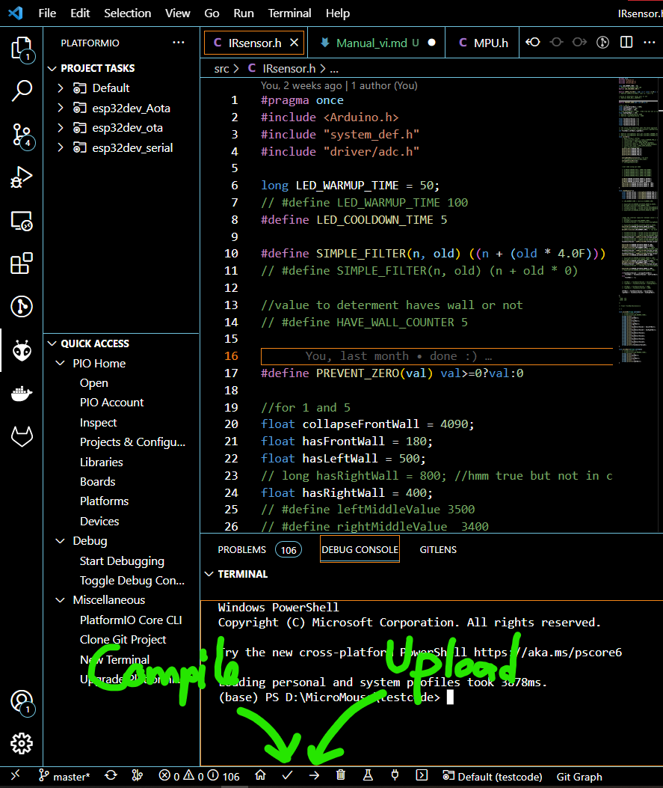
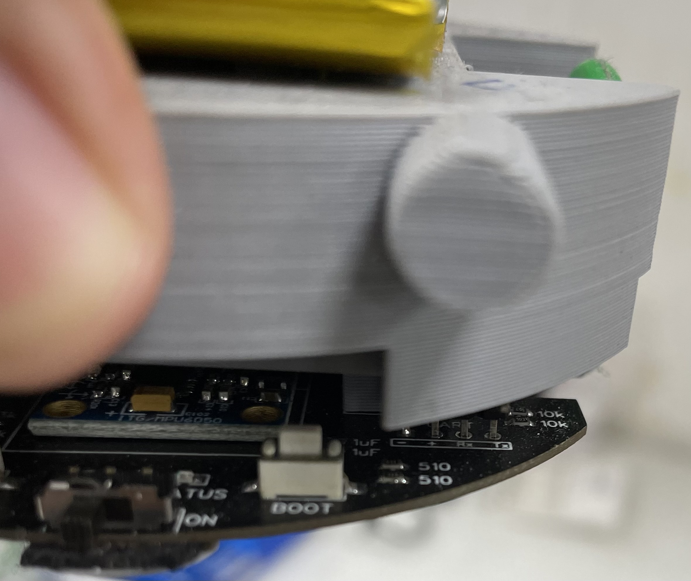
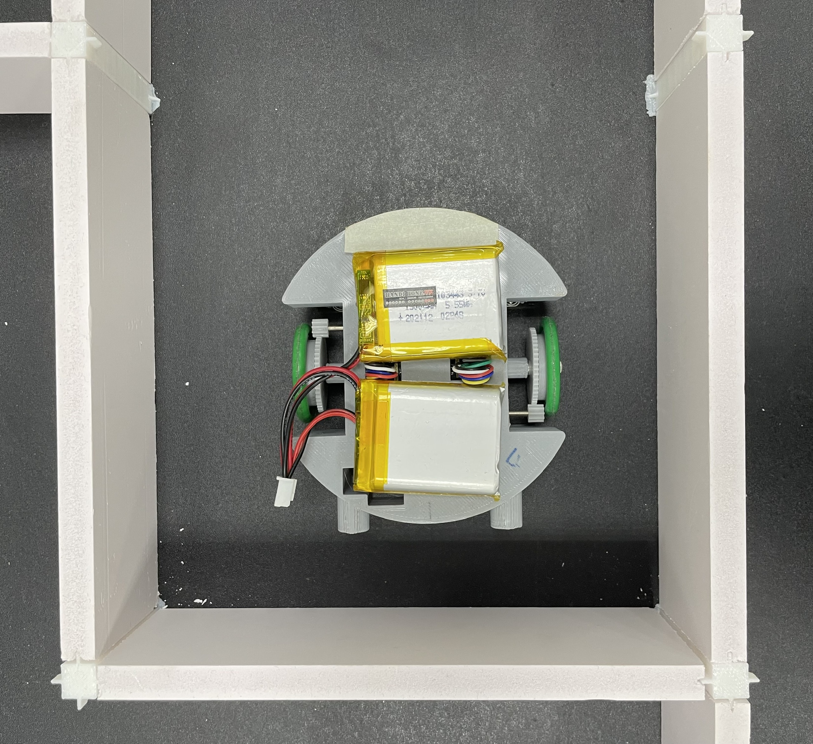

# HƯỚNG DẪN CÀI ĐẶT VÀ SỬ DỤNG MICROMOUSEVN

*by Anh Nguyễn - Cemu0*

## 1. CÀI ĐẶT
### Cài đặt PlatformIO
1. Tải về mã nguồn của robot
2. Mở thư mục chứa mã nguồn bằng VSCode (lúc này VSCode sẽ khuyến nghị cài đặt PlatformIO), cài đặt PlatformIO sau đó khởi động lại VSCode.
3. Sử dụng các nút phía dưới để biên dịch và nạp code lên chuột.

### Nạp phần mềm cho Robot
Mặc định phần mềm đã được nạp sẵn trên robot, tham khảo phần tiếp theo để nạp code qua WIFI.    

Trong trường hợp cài đặt phần mềm bị lỗi dẫn đến việc không thể nạp code qua WiFi, có thể nạp code bằng mạch convert USB-UART:  

1. Cài đặt nạp code bằng cách comment dòng sau:
   `default_envs = esp32dev_Aota`
   và huỷ comment dòng 
   `default_envs = esp32dev_serial'
2. Kết nối với chân cắm trên robot   
- (+) -> VCC
- (-) -> GND
- (RX) -> TX
- (TX) -> RX   
3. Nhấn giữ nút BOOT trong khi nhấn RESET để chip chuyển vào chế độ BOOT.
4. Nhấn nút upload để nạp code.  

### Kết nối với chuột thông qua WiFi
Mặc định Micromouse sẽ kết nối với Wifi có SSID là `mouse` và Password `micromouse`.  

Sau khi kết nối, sử dụng `default_envs = esp32dev_Aota` để nạp code qua wifi.  

Để điều khiển, có thể kết nối với Robot thông qua Telnet, sử dụng Putty kết nối với Robot với mDNS mặc định là myesp.  

Khi kết nối thành công có thể điều khiển, thay đổi các thông số thông qua giao diện Telnet.  
   
## 2. Cân chỉnh Robot

Để Robot di chuyển thẳng trong mê cung đầu tiên cần phải cân chỉnh cảm biến hai bên hông, quá trình cân chỉnh như sau, di chuyển robot đến vị trí thích hợp, chạy thử hoặc đọc giá trị debug (sử dụng lệnh b5 ... lúc này ta sẽ thấy giá trị in ra của năm cảm biến theo thứ tự cảm biến từ trái sang phải), tiếp theo thay đổi các thông số bằng cách sử dụng các lệnh trong hàm `telnetStreamHandle()`.   
VD: để thay đổi đường kính bánh thành 32.5mm ghi lệnh v32.5 vào cửa sổ telnet.

Lưu ý: các thông số cần được lưu lại vào code tại vị trí tương ứng, vì việc thay đổi các thông số này chỉ được lưu vào RAM và sẽ thay đổi thành giá trị mặc định mỗi khi khởi động lại.

1. Cân mắt đọc cảm biến trong các trường hợp di chuyển trong ô, hasFrontWall cần phải phát hiện tường được xa hơn các cảm biến khác hasLeftWall và hasRightWall cần phải đọc được khi robot chạm tường phía đối diện (vì khi di chuyển không đảm bảo robot sẽ đọc được) 
2. Cân giá trị di chuyển theo tường, rightMiddleValue, leftMiddleValue và centerMoveVal, vì nếu chỉ sài gyro robot sẽ lệch và đụng tường. Để robot chính giữa và tính toán giá trị cảm biến faceSensorValue1 - faceSensorValue5 - centerMoveVal = 0, tương tự với rightMiddleValue, leftMiddleValue.
3. Cân giá trị đường kính bánh khi chạy bằng cách thay đổi stopX = 1, stopY = giá trị ô max có thể thử để xem robot di chuyển theo đường thẳng trên bản đồ có dừng lại với ô mong muôn hay không, sau đó tính toán và cập nhập whellDiameter để robot di chuyển ít sai số nhất.  
4. Với thuật toán di chuyển theo đường bên phải robot sẽ cua khi không có tường phải => cân góc cua => đảm bảo robot phải về giữa sau khi cua lần 1, lần 2 , thay đổi turnSpeed => tốc độ cua, càng nhanh đường kinh đường cua càng nhỏ, (turnAccelerate => giá trị gia tốc để cua, không quá cần chỉnh), turnTime => thời gian cua, càng lớn bán kính cua càng rộng) cũng như startPosAfterTurn để đảm bảo chuột giữ vị trí sau các lần cua !!!. Tham khảo slide Controller  
5. Cân chỉnh cảm biến 2 bên để chuột có thể tự cân chỉnh vị trí trong ô, mỗi khi gặp ô cụt chủ yếu là setPointFrontValue, giá trị cảm biến mặt trước, calibrateForwardValue, calibrateRotateValue (chắc sẽ không cần chỉnh nhiều).

Trên thực tế các thông số PID đã được cân chỉnh tương đối ổn định nên, không cần phải thay đổi nhiều nhưng trong trường hợp cần thiết có thể thay đổi bằng cách tương ứng như trên.   

## 3. CÀI ĐẶT THUẬT TOÁN

Thuật toán được cài đặt được để trong file `moveAlgorithm.h`, nằm trong hàm `calculateAlgo()`, với thuật toán di chuyển trong mê cung theo bàn tay phải (RIGHT HAND MOVE). Các thuật toán khác có thể được cài đặt tương tự tại đây.

## 4. SẠC PIN
Robot sử dụng pin Li-ion 2 cell cho ra dòng xả lớn, công suất cao để có thể di chuyển nhanh trong mê cung. Để sạc pin cần sử dụng bộ sạc cân bằng nhằm bảo vệ pin và tối ưu công xuất. Mỗi viên pin đi kèm robot bao gồm một đầu xạc và một đầu sử dụng được nối sẵn vào thân robot.  
Sử dụng đầu sạc này nối vào bộ sạc cân bằng pin tương ứng để sạc.  

### Một số lưu ý khi sử dụng pin:  
Điện áp của pin nên được sử dụng trong khoảng từ 2.7 vol đến 4.2v. Bạn nên kiểm tra điện thế của pin và sạc nếu điện áp xuống dưới 3.3v. Nếu để điện áp xuống quá sâu, dưới 2.7v pin sẽ bị hư hỏng. Lưu ý rằng hiệu suất hoạt động hay tốc độ tối đa của robot sẽ thay đổi theo điện áp. 
Nếu không sử dụng trong thời gian dài, bạn nên để pin ở 3.7 vol để bảo vệ pin

## 5. Điều khiển từ xa Robot
Trong mã nguồn có sẵn file `control.html` có thể sử dụng để điều khiển từ xa Robot thông qua *Websocket* bạn có thể thử nghiệm điều khiển robot bằng file này cũng như giao thức đã được cài đặt sẵn trên chuột.

   
   
**Chúc bạn thành công !**