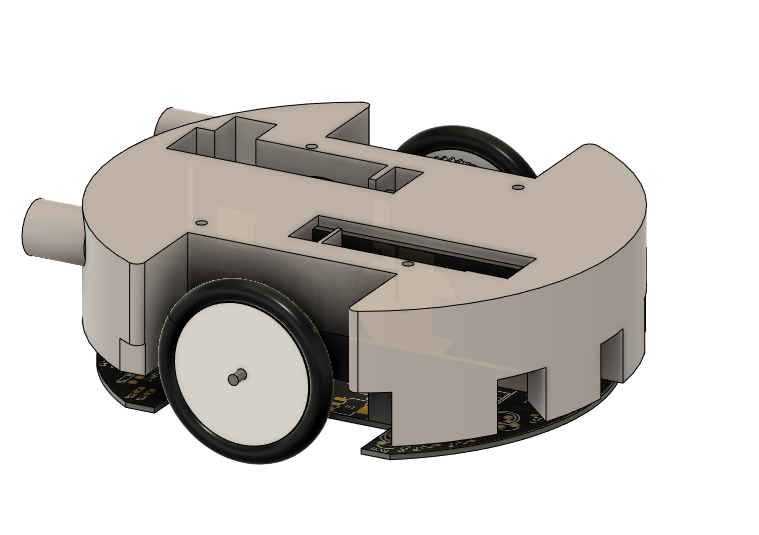
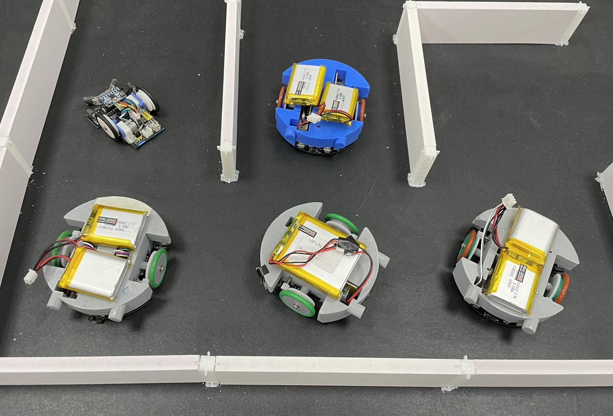

# ViMicroMouse 

This is the source code of the ViMicroMouse robot. Design and Made in Viet Nam, We are trying to create a cheap robot for use in lab and hope fully in local competition.  
You can see the Robot run with this Code at [HERE](https://youtu.be/DZiLTkW6-m4).
## INSTALLATION
1. Clone this repo
2. Open it in VSCode and install PlatformIO (vsc should recommend you install it) 
3. Now you should able to build the code, By default awesome guys already do everything in the background for you to setup and build stuff. 
## USAGE
After connect with the mouse using telnet to control the mouse.   
More detail [here (Manual_vi.md)](Manual_vi.md) (only Vietnamese version available)  
Check the code ... or [my youtube chanel](https://www.youtube.com/channel/UC28B70ToFInzz8yKEcRnYIQ) for more detail =) 

## REFERENCE
[1] Green Ye - [Project Futura](http://micromouseusa.com/?page_id=1342)  
[2] Minikirani Amaya Dharmasiri - [Micromouse from scratch](https://medium.com/@minikiraniamayadharmasiri/micromouse-from-scratch-algorithm-maze-traversal-shortest-path-floodfill-741242e8510)  
[3] Mack - [A Micromouse simulator](https://github.com/mackorone/mms)  
[4] @ahadik - [MicroMau5](https://github.com/ahadik/micromau5_code)
[5] adam2392 - [Code for micromouse ieee competition 2015. Using PID, flood fill algorithm and programming in C.](https://github.com/adam2392/ieee_micromouse)  
